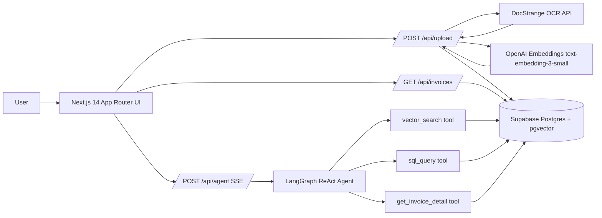
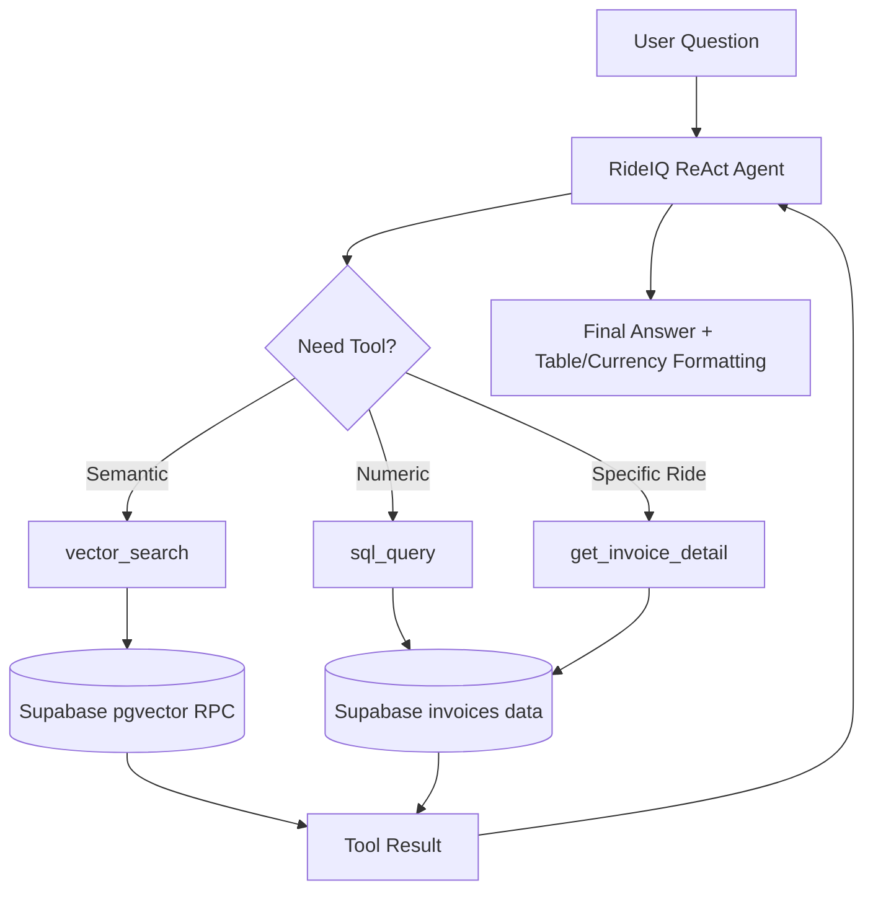

# RideIQ

RideIQ is a production-grade Agentic RAG web app for analyzing Rapido ride invoices. Users upload PDF invoices, the system extracts structured data with Nanonets DocStrange OCR, stores records plus vectors in Supabase, and exposes a LangGraph-powered chat analyst for natural language finance questions.

## Architecture Overview



## Why DocStrange by Nanonets

RideIQ uses DocStrange as the OCR + extraction engine because it is purpose-built for high-accuracy document intelligence workflows and is available with a free developer-friendly API tier. This project also highlights Nanonets in a portfolio context, including the claim that DocStrange ranks #1 on IDP leaderboard evaluations above Gemini and Claude for document extraction benchmarks.

## Tech Stack

- Frontend: Next.js 14 App Router, shadcn/ui, Tailwind CSS
- Backend: Next.js API routes (Node runtime)
- Agent Framework: LangGraph.js (`@langchain/langgraph`)
- LLM: OpenAI GPT-4o (`@langchain/openai`)
- OCR: Nanonets DocStrange (`https://extraction-api.nanonets.com`)
- Database: Supabase Postgres + pgvector
- Embeddings: OpenAI `text-embedding-3-small`
- Deployment Target: Vercel

## LangGraph Agent (3-tool ReAct)

The assistant can reason over qualitative and quantitative invoice questions by selecting tools dynamically:

1. `vector_search` for semantic lookups on embedded invoice chunks.
2. `sql_query` for safe, intent-mapped analytical computations.
3. `get_invoice_detail` for full details by `ride_id`.



## Setup Instructions

### 1) Create Supabase schema

Run the SQL from `PLAN.md` in the Supabase SQL editor (includes `invoices`, `invoice_chunks`, pgvector function `match_invoice_chunks`).

### 2) Configure environment variables

Copy and fill:

```bash
cp .env.local.example .env.local
```

Required values:

- `OPENAI_API_KEY`
- `DOCSTRANGE_API_KEY`
- `NEXT_PUBLIC_SUPABASE_URL`
- `NEXT_PUBLIC_SUPABASE_ANON_KEY`
- `SUPABASE_SERVICE_ROLE_KEY`

### 3) Install dependencies

```bash
npm install
```

### 4) Run locally

```bash
npm run dev
```

App routes:

- `/` upload + OCR ingest
- `/dashboard` stats + invoice table + filters
- `/chat` streaming agentic analysis

## Sample Questions

- "How much did I spend on rides in March?"
- "Which week had the most rides?"
- "What is my average fare per km?"
- "How much GST have I paid total?"
- "Which captain drove me the most?"
- "Show me all cash rides over 200 rupees"

## Local Verification Workflow

1. Put one or more Rapido PDFs in `assets/`.
2. Upload from `/` and confirm extraction preview appears.
3. Open `/dashboard` and verify stats/table fields populate.
4. Open `/chat` and test tool-triggering prompts (semantic + aggregate + ride-id).

## Deployment Notes (Vercel)

- Keep API routes on Node runtime.
- `maxDuration = 60` is set for upload and agent streaming routes.
- Add all env vars in Vercel project settings.
- Ensure pgvector extension is enabled in Supabase.

## Live Demo

- Demo URL: _Coming soon_
